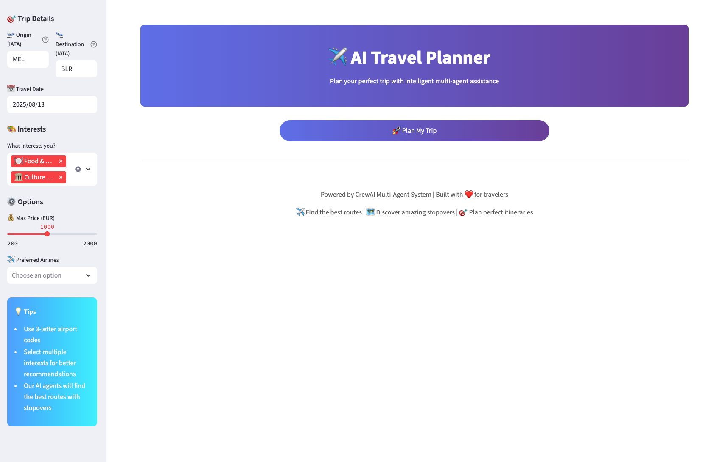

# ✈️ Multi-Agent AI Travel Planner: Meaningful Journeys, Not Just Cheap Flights



## Abstract

**Why settle for just the cheapest flight?**

This project redefines travel planning: instead of simply finding the lowest fare from Melbourne (MEL) to Bengaluru (BLR), it helps you discover the most cost-effective and *meaningful* journey—even if that means planning a short, enriching stopover in cities like Singapore. Powered by a collaborative multi-agent system, this planner not only finds great flights, but also turns layovers into opportunities for adventure, with AI-generated city guides for food, hotels, and attractions.

---

## Introduction

Classic travel aggregators (like Skyscanner or Google Flights) focus on minimizing time and cost, treating layovers as a necessary evil. This project goes further: it treats stopovers as opportunities. By orchestrating specialized AI agents and integrating real-time APIs, the system recommends routes that balance price and experience, and enriches your journey with personalized city guides for each stopover.

---

## System Highlights

- **Smart Routing:** Finds both direct and 1-stop flights, surfacing routes with layovers that can become stopovers.
- **Experience-Driven Evaluation:** Ranks routes by both cost and "experience value"—factoring in your interests (e.g., food, culture, shopping).
- **Enriched Stopovers:** For each stopover city, generates a 1–2 day itinerary with food, hotels, and attractions, using live web search and AI curation.
- **Modern, Interactive UI:** Plan, compare, and download your journey in a beautiful Streamlit app.

---

## How It Works (Step by Step)

1. **User Input:**
   - Enter origin, destination, date, and interests (e.g., "culture," "food").
2. **Flight Search:**
   - The Flight Planner agent finds direct and 1-stop flights using Amadeus API.
3. **Route Evaluation:**
   - The Route Evaluator agent scores each route by price and stopover potential, applying bonuses for cities matching your interests.
4. **Itinerary Generation:**
   - The Local Guide agent creates a tailored city guide for each stopover, using web search, scraping, and fallback content.
5. **Results Display:**
   - The UI presents not just the cheapest route, but the most meaningful journey—with detailed stopover guides and a downloadable plan.

---

## Why This Is Different (and Better)

- **Classic aggregator:**
  - “Here’s the cheapest/fastest way to get from MEL to BLR.”
- **This system:**
  - “Here are the best ways to get from MEL to BLR, and if you’re open to a stopover, here’s how you can turn a layover in Singapore (or another city) into a mini-adventure—with food, hotels, and attractions tailored to your interests.”

---

## Example Output

- **Flight 1:** MEL → SIN (2 days) → BLR  
  - **Cost:** $X  
  - **Singapore Guide:**
    - Day 1: Hawker food tour, Gardens by the Bay
    - Day 2: Chinatown, Marina Bay Sands, local hotel recs
- **Flight 2:** MEL → KUL (1 day) → BLR  
  - **Cost:** $Y  
  - **Kuala Lumpur Guide:**
    - Day 1: Petronas Towers, street food, Batu Caves

---

## Multi-Agent Architecture

- **Flight Planner Agent:** Finds direct and 1-stop flights (Amadeus API)
- **Route Evaluator Agent:** Ranks routes by price and stopover experience, factoring in your interests
- **Local Guide Agent:** Generates 1–2 day itineraries for stopover cities using web search and scraping

**Tools Integrated:**
- Amadeus API (real-time flights)
- Custom stopover evaluator (interest-based scoring)
- Serper API (web search for city guides)
- Web scraping (real content, with fallback itineraries)

**Orchestration:**
- All agents and tools are coordinated using CrewAI for seamless workflow and context passing.

---

## Installation & Setup

**Requirements:**
- Python >=3.10, <3.14

**Install dependencies:**
```bash
pip install -r requirements.txt
```

**.env file:**
```
GEMINI_API_KEY=your_gemini_api_key
AMADEUS_CLIENT_ID=your_amadeus_client_id
AMADEUS_CLIENT_SECRET=your_amadeus_client_secret
SERPER_API_KEY=your_serper_api_key
```

---

## Usage

**Start the app:**
```bash
streamlit run src/travel_planner/ui.py
```

**How to use:**
1. Enter your trip details and interests
2. Click **Plan My Trip**
3. Explore and compare both cost-effective and meaningful journey options
4. Download your full travel plan (including stopover city guides)

---

## Project Structure

```
travel_planner/
├── src/
│   └── travel_planner/
│       ├── crew.py           # Agent/task/tool definitions
│       ├── ui.py             # Streamlit UI
│       ├── main.py           # App entry point and crew runner
│       ├── config/           # Agent and task YAML configs
│       │   ├── agents.yaml
│       │   └── tasks.yaml
│       ├── tools/
│       │   ├── flight_search.py
│       │   ├── stopover_evaluator.py
│       │   └── local_guide_tools.py
│       └── ...
├── requirements.txt
├── .env
├── ui-preview.png
├── test_improvements.py
└── README.md
```

---

## Technical Highlights

- **Smart, modular agents** for each planning phase
- **Custom tools** for flight search, scoring, web search, and scraping
- **Interest-based route ranking** for meaningful journeys
- **Fallback logic** ensures you always get a city guide, even if scraping fails
- **Modern, responsive UI** with progress feedback and download options

---

## Future Enhancements
- Multilingual support
- Voice-based interaction
- Hotel/activity booking integration
- Real-time weather and event recommendations

---

## Support & Community
- [CrewAI Documentation](https://docs.crewai.com)
- [CrewAI GitHub](https://github.com/joaomdmoura/crewai)
- [Discord Community](https://discord.com/invite/X4JWnZnxPb)

---

**Built with ❤️ to help you turn every trip into an adventure, not just a transfer.**
